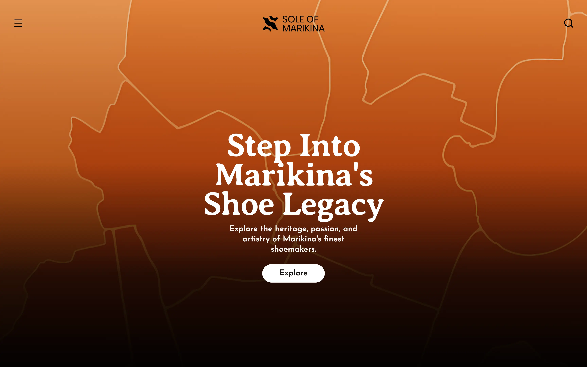

👞 Interactive showcase of shoe heritage and craft, powered by historical docs, process videos, and a digital gallery to highlight premium artisan quality.

## ☁️ Deploy your own

[](https://vercel.com/new/clone?repository-url=https://github.com/KurutoDenzeru/SoleOfMarikina)  [](https://app.netlify.com/start/deploy?repository=https://github.com/KurutoDenzeru/SoleOfMarikina)

## ✨ Features

- **Responsive Design** — Optimized for all devices, from mobile to desktop.
- **Interactive Map** — Explore Marikina's shoe stores with an integrated map.
- **Dynamic Routing** — Seamless navigation through individual store pages and sections.
- **Fast Performance** — Built with Astro for lightning-fast static site generation.
- **Accessible UI** — Components from Shadcn UI ensure a11y compliance and great UX.
- **Open Source** — MIT licensed; customize and deploy your own version freely.

## 🧱 Tech Stack

- [Astro](https://astro.build/): Modern static site generator for building fast, content-focused websites.
- [Tailwind](https://tailwindcss.com/): Utility-first CSS framework for rapid UI development.
- [Shadcn UI](https://ui.shadcn.com/): Re-usable components built using Radix UI and Tailwind CSS.
- [TypeScript](https://www.typescriptlang.org/): Strongly typed programming language that builds on JavaScript.

## ⚡ Getting Started

Clone the repo, install deps, and boot the dev server:

```bash
git clone https://github.com/KurutoDenzeru/SoleOfMarikina.git
cd SoleOfMarikina
bun install
bun run dev
```

Open [http://localhost:4321](http://localhost:4321) to view the app.

## 📦 Build for Production

```bash
bun run build
bun start
```

## 🗂️ Configuration

The editor is componentized under `src/components`. Key areas to customize are:

```text
src/                        # Source directory for the Astro project
  components/               # Reusable UI components (including Shadcn UI)
  layouts/                  # Astro layout components for structuring pages
  lib/                      # Utility functions and shared logic
  pages/                    # Page routes and endpoints
    stores/                 # Individual store pages and sections
      [store]/              # Dynamic routes for stores
        [section].astro     # Dynamic section route
        index.astro         # Dynamic store index
      brads-trendies/       # Brad's Trendies
      nico-angelo/          # Nico Angelo
      seacrest/             # Seacrest
public/                     # Static assets served directly
  fonts/                    # Custom fonts used in the project
  icons/                    # Favicon and app icons
  Logo/                     # Brand logos
  map/                      # Map assets
  pictures/                 # Images and gallery pictures
```

## 🤝🏻 Contributing

Contributions are always welcome, whether you’re fixing bugs, improving docs, or shipping new features that make the project better for everyone.

Check out [Contributing.md](Contributing) to learn how to get started and follow the recommended workflow.

<!-- Please adhere to this project's `Code of Conduct`. -->

## ⚖️ License

This project is released into the public domain and is provided as-is, without warranty. You are free to use, modify, distribute, and do whatever you want with the code, with no restrictions.

For the full legal text, see the [Unlicensed](LICENSE) file.
